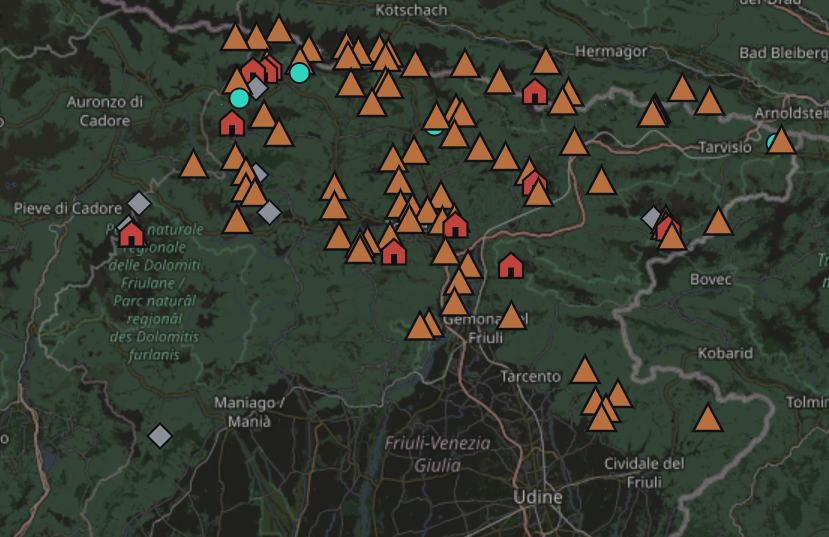

# Mountain Trails

An interactive map of every peak, lake and rifugio I've reached while hiking since 2022 —
mostly the Julian and Carnic Alps, an hour from where I grew up. Built solo, end to end, in
plain HTML/CSS/JS with no framework and no build step.

## Features

- Leaflet map with custom markers, plus a list view of the same data
- A stats bar and charts (hikes per year, elevation, etc.) computed live from the dataset
- A collapsible history timeline with a scrubber to replay when each place was first reached
- Filtering by year, region and trip type

## Stack

Vanilla JavaScript, [Leaflet](https://leafletjs.com/) for the map, no dependencies otherwise.

## Run it

It's static — clone the repo and open `index.html`, or serve the folder with any static
file server.

---

Originally built as a page on my personal portfolio site; extracted here as a standalone repo.
